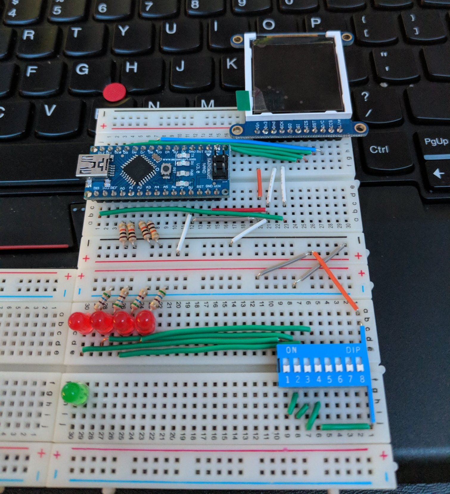

# Day 0 (Jan 12, 2018)

## Build

Video output component

## Parts

* Adafruit 1.44 TFT LCD 128*128
* Arduino Micro (Nano)

* A bunch jumper wires
* Few LED
* Few 200ohm Resistor
* 8 bit dip switch
* 20k ohm resistor

## Build progress

When I tried to connect LCD to Arduino Micro, I have encountered a sketch upload issue that bricked the arduino. Currently that board is unable to be recognized by the computer, and my attempt to burn bootloader has failed. The Arduino Micro have this weird bootloader and no USB chip made them very easy to brick

I ordered some Arduino Nano clones from amazon, these do have dedicated USB chip and very easy to program. I was able to hook the LCD to Arduino and run the display test program. I am also waiting for the 8 bit shift register so I can build a 16 bit address input for the display. My original design is to make the display 4bit color. It is going to be indexed.

## More information

### Pins

A0-A3 (Analog as digital input) - color

## Images

### Day 1

