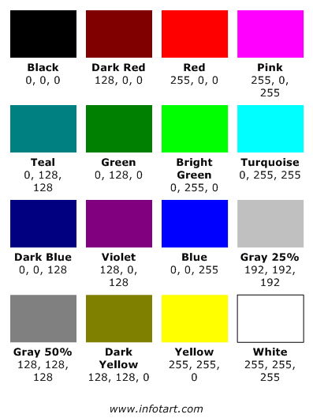
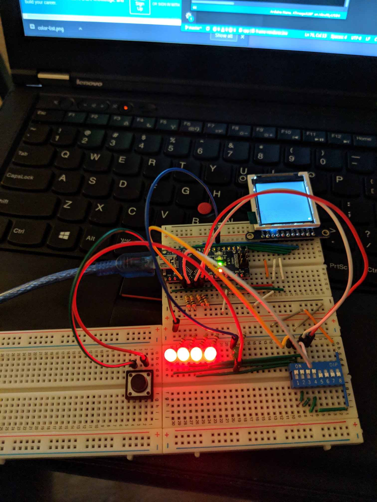

# Day 2 (Jan 13, 2018)

## Build

Video output component

## Build progress

I have written a very simple sketch in arduino using the same draw wait and update loop. I hooked up interrupts and also finalized a color list from 0-15

```c++
const uint16_t colorMap[] = {
    0x0000,
    0x8000,
    0xF800,
    0xF81F,
    0x0410,
    0x0400,
    0x07E0,
    0x07FF,
    0x0010,
    0x8010,
    0x001F,
    0xC618,
    0x8410,
    0x8400,
    0xFFE0,
    0xFFFF
};
```
I wired some led to the board to show the current value feeded to the arduino and also a switch to toggle write signal.

### Reference



## More information

### Pins

Digital 2 - update interrupt pin (FALLING trigger)

## Images

### Day 1

