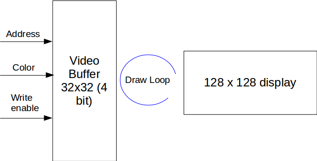

# Video Output

The original design from Ben Eater does not have a solution to output video. But because we are building a "computer" we need a way to display output other than the 7 segment display. 

## High level design

We are following the retro design of video output. The entire system work as follows:

The video output system works separately from the entire system, it hooks up with the existing system (basically the display buffer is an extension of existing computer memory). The address range is undetermined. 

## How it works?

The framebuffer and display works on the separately Arduino board. Initially when the system is booted up, it will clear the framebuffer and create a loop that runs at 60hz dumping values from framebuffer to the display. It also sets an interrupt on the write line, so when the line goes from high to low (or low to high) it will modify the pixel value from that address.

## Parts

* Adafruit 1.44" TFT LCD [link](http://adafru.it/2088)
* Arduino Micro [link](https://store.arduino.cc/usa/arduino-micro)